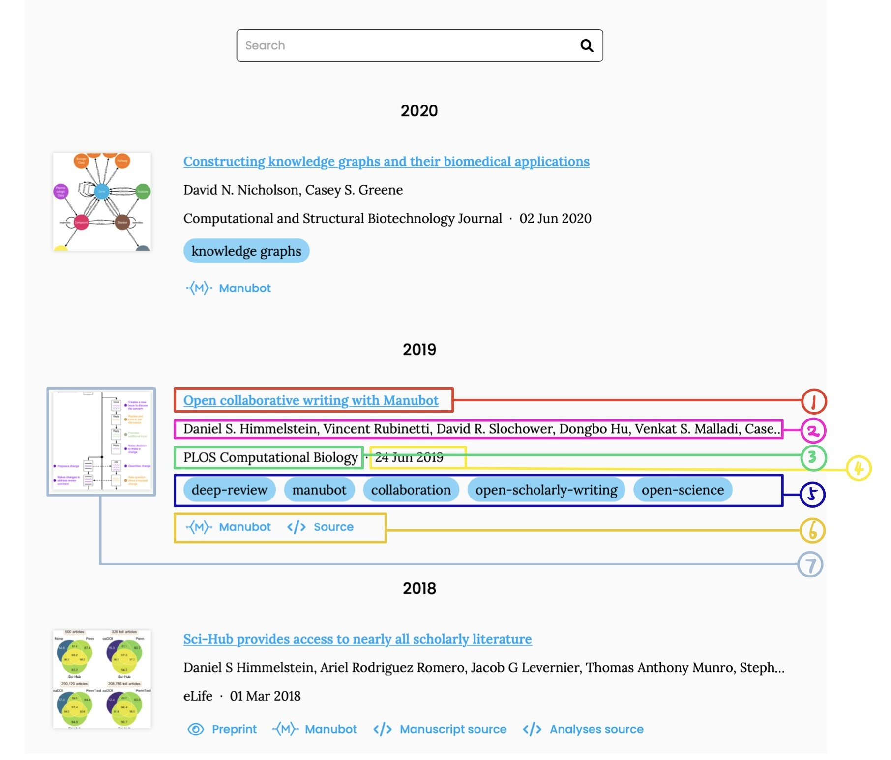
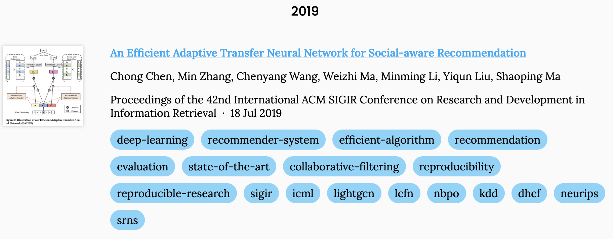
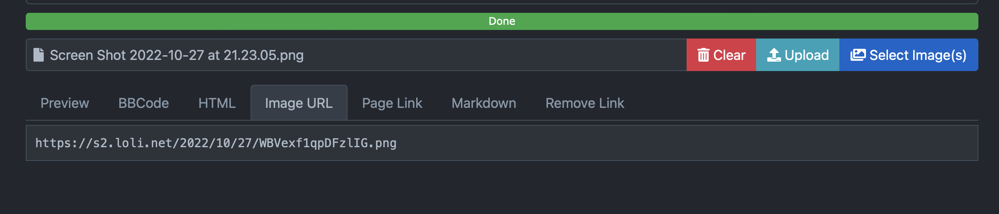

# THUIR Publication Collection Info
## Overview
These days we've been working on constructing a website for THUIR. Here's the [demo](https://thuir.github.io/lab-website-template/) of the website.

Now we're working on the publication collection, which needs everyone to submit their publication list in a pre-defined manner, if any. A demo for publication page is available [here](https://thuir.github.io/lab-website-template/publications/). 



The image above shows the basic layout of the publication page. Publications are categorized by year, descendingly. Each publication is represented by a block, which contains the following components:
1. Title
2. Author List
3. Conference/Journal
4. Publication Date
5. Tags
6. Other Links (like GitHub link to your paper code, website for your paper, etc.)
7. Picture of your paper (a model screenshot or any picture you like)

Although seven parts are displayed in this block, we do not need to fill them all. Actually, the minimal requirement for each paper is only the DOI of the paper. The template will get the title, author list, conference/journal, publication date automatically. Adding picture link and GitHub repository link are more than welcome!

## YAML File for Publication Info
Here is the corresponding YAML file for the layout shown above:
```yaml
- id: doi:10.1145/3331184.3331192
  image: https://s2.loli.net/2022/10/27/voPpnRds8YqGaSJ.png
  extra-links:
    - type: source
      link: https://github.com/chenchongthu/enmf
  _title: "An Efficient Adaptive Transfer Neural Network for Social-aware Recommendation"
  _first_author: Chong Chen
```
This example seems to be complicated because it comes from the orginal repository, aiming to show the functionality of the template. But the ONLY compulsory item is the `id` field, which is the DOI of your paper. `image` and `repo` are recommended since the default image for your paper is quite ordinary if you do not specify an image, and `repo` is essential for reproducibility.

A recommended template for a single paper is as follows:
```yaml
- id: doi:10.1145/3331184.3331192
  image: https://s2.loli.net/2022/10/27/voPpnRds8YqGaSJ.png
  repo: chenchongthu/ENMF

```
It is quite an easy way out for adding a paper, with the corresponding layout shown below:


## Submission Guide
To ensure convenience of both fellows and website maintainers, we decide to use **Pull Request** to submit publication info. Pull Request is a powerful feature of GitHub collaboration. If you are not familiar with it, Google must be your strong backup! 

Here are some basic steps to submit your publication info:

1. Fork [this repository](https://github.com/nmrenyi/thuir-publication-info) to your own GitHub account.
2. Add your own YAML file with your publication information in it.
   - Your YAML file should be named as `<name><the-year-you-enter-THUIR><phd/master>.yaml`, like `chenchong2017phd.yaml`.
   - Your YAML file should be placed in the folder `info/`, the save folder with `chenchong2017phd.yaml`.
3. Commit and push your changes to your own repository.
4. Raise a Pull Request to the `main` branch of [this repository](https://github.com/nmrenyi/thuir-publication-info).
5. Wait for the maintainers to review your PR(Pull Request). If everything goes well, your PR will be merged into the main branch. Otherwise, the maintainer will reject your PR and you will be notified to make some changes.

***Submission deadline: 29, October, 2022 (19:59:59, Beijing Time)***

## QA
### Content Related
1. How can I get DOI for my paper?
   - On ACM Digital Library website or arXiv.
2. How can I get the image link for my paper, with a image on my computer locally?
   - First, get a screenshot of your paper so that it can be an illustrative as well as representative. A screenshot of your main model may be a good choice.
   - Second, square it since the frame for paper picture is square. With a non-square picture, the display could be weird. Squaring an image could be achieved easily by [this website](https://squaremyimage.com).
   - Third, upload the picture to a picture bed, so that you can get a public link for it, which can be used in the `image` field. A starter friendly picture bed is [here](https://smms.app). Be sure to use the **Image URL** rather than links in other tabs. 

### Submission Form Related
1. Why use Pull Request instead of using questionnaires like Wenjuanxing?
   - Wenjuanxing is quite a direct way to collect information including files. However, suppose our beloved senior student each has 100+ papers. Then she/he needs to submit the questionnaire for 100 times. Why bother? With pull request collaboration technique, each student only needs to submit one single file containing all the publication information.
2. Is this the only chance to submit my publication info? Can I make modifications and additions later?
   - Certainly you can modify your information and insert more afterwards. If you're quite in a hurry these days, you may just submit DOI number for your papers. You can make further modifications with pull request later on. If spare, however, submitting DOI, image and GitHub repository link in one shot is still suggested.
3. What is the benefit for all these efforts?
   - Build a professional website for THUIR, which benefits everyone, including yourself.

## Contact
If you have any questions, please contact REN Yi, by WeChat or [Email](mailto:renyi1006@gmail.com). Any suggestions or questions are welcome!
