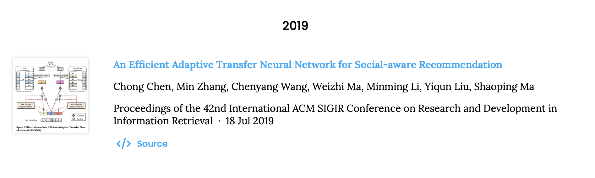

# THUIR Publication Collection Info
## Overview
These days we've been working on constructing a website for THUIR. Here's the [demo](https://thuir.github.io/lab-website-template/) of the website.

Now we're working on the publication collection, which needs everyone to submit their publication list in a pre-defined manner, if any. A demo for publication page is available [here](https://thuir.github.io/lab-website-template/publications/). 


The image above shows the basic layout of the publication page. Publications are categorized by year, descendingly. Each publication is represented by a block, which contains the following components:
1. Title
2. Author List
3. Conference/Journal
4. Publication Date
5. Tags
6. Other Links (like GitHub link to your paper code, website for your paper, etc.)
7. Picture of your paper (a model screenshot or any picture you like)

Although seven parts are displayed in this block, we do not need to fill them all. Actually, the minimal requirement for each paper is only the DOI of the paper. The template will get the title, author list, conference/journal, publication date automatically. Adding picture link and GitHub repository link are more than welcome!

## YAML File for Publication Info
Here is the content of YAML file for [publications in 2019](https://thuir.github.io/lab-website-template/publications/#2019). You can also find this YAML file in [sources-2019.yaml](https://github.com/THUIR/lab-website-template/blob/main/_data/sources-2019.yaml).

```yaml
- id: doi:10.1145/3331184.3331192
  image: https://s2.loli.net/2022/10/27/voPpnRds8YqGaSJ.png
  extra-links:
    - type: source
      link: https://github.com/chenchongthu/enmf
  _title: "An Efficient Adaptive Transfer Neural Network for Social-aware Recommendation"
  _first_author: Chong Chen
```

Here is the publication information generated by the YAML config above:


In this example, the website template reads the DOI, thus getting the title, author list, conference name, publication date. The picture and source is added manually by `image` and `extra-links`, respectively.

`_title` and `_first_author` will not be utilized by the template for generating the page. These two fields, however, are **recommended** to add. It's out of human-readability of the YAML configuration file. Without these two fields, which means DOI is the only identifier, it could be hard for you to find the corresponding configuration for your paper, if you want to modify the information later.

## Submission Guide
To ensure convenience of both fellows and website maintainers, we decide to use **Pull Request** to submit publication info. Pull Request is a powerful feature of GitHub collaboration. If you are not familiar with it, Google must be your strong backup! 

Here are some basic steps to submit your publication info:

1. Fork the [lab-website-template repository](https://github.com/THUIR/lab-website-template) to your own GitHub account.
2. Locate the YAML file for the year you want to add your paper to. For example, if you want to add a paper published in 2021, you should locate [sources-2022.yaml](https://github.com/THUIR/lab-website-template/blob/main/_data/sources-2022.yaml).
3. Commit and push your changes to your own repository.
4. Raise a Pull Request to the `main` branch of the [lab-website-template repository](https://github.com/THUIR/lab-website-template).
5. Wait for the maintainers to review your PR(Pull Request). If everything goes well, your PR will be merged into the main branch. Otherwise, the maintainer will reject your PR and you will be notified to make some changes.

## QA
### Content Related
1. How can I get DOI for my paper?
   - On ACM Digital Library website or arXiv.
2. How can I get the image link for my paper, with a image on my computer locally?
   - The picture adding guide of the original template is [here](https://github.com/manubot/catalog#thumbnail-guidelines) and [here](https://github.com/greenelab/lab-website-template/wiki/Tips).
   - Here is how I do it:
     1. Select a striking picture of your paper.
     2. Square the picture for better display on the webpage by this [online tool](https://squaremyimage.com).
     3. Upload the picture to a picture bed like [SM.MS](https://smms.app).
     4. Copy the link of the picture.
     5. Paste the link to the YAML file.
   
   Be sure to use link for the **actual raw image**, rather than links in other tabs. The raw image link in [SM.MS](https://smms.app) can be found in `Image URL` tab. 

### Submission Form Related
1. Why use Pull Request instead of using questionnaires like Wenjuanxing?
   - Wenjuanxing is quite a direct way to collect information including files. However, suppose our beloved senior student each has 100+ papers. Then she/he needs to submit the questionnaire for 100 times. Why bother? With pull request collaboration technique, each student only needs to submit one single file containing all the publication information.
2. Is this the only chance to submit my publication info? Can I make modifications and additions later?
   - Certainly you can modify your information and insert more afterwards. If you're quite in a hurry these days, you may just submit DOI number for your papers. You can make further modifications with pull request later on. If spare, however, submitting DOI, `_title`, `_first_author`, image and GitHub repository link in one shot could be cool!
3. What is the benefit for all these efforts?
   - Build a academic website for THUIR, which benefits everyone, including yourself.

## Contact
If you have any question, please contact REN Yi, by WeChat or [Email](mailto:renyi1006@gmail.com). Any suggestions or questions are welcome!
